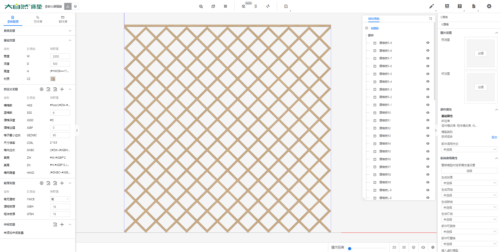

# X形酒格

首先这个酒格分为两类板件，高度和宽度成为一种特定的比例。

根据我们已知条件，那么我们首先得知的是，这个模型的高度或者宽度，我们只能完全自定义其中一个。

根据设计思路，宽度根据门或者其他的结构，基本已经确认，所以酒格的宽度我们一定要能设置为和柜体相关联的。

那么酒格上存在一个层板，紧密贴合也不易出错。

酒格第二个需求，根据宽度，自动计算出合适的宽度数量。高度则是根据格子的数量来定高。

第三个需求就是四周的缝隙。酒格可能不会刚刚好四周需要留缝隙，于是我们整理出来一个真宽和真高，

格子不能太小，于是我们整理出一个格内最小边长。

根据格子最小边长，求出最小的当前格子的边长。

在根据格子的边长求出格子的横向对角宽度。使用了倍率。就是根号2。

## 柜体参数

### 参数的说明

只记录了关键必要的参数。

板件共有39块板件。分别为

RU：9

R：1

RD：9

LU：9

L：1

LD：9

层板一个

### 基础变量

| 名称 | 引用名 | 参数类型 | 隐藏条件 | 最小值 | 最大值 | 当前值                                                       |
| ---- | ------ | -------- | -------- | ------ | ------ | ------------------------------------------------------------ |
| 宽度 | W      | 区间     |          | 10     | 9999   | 1600                                                         |
| 深度 | D      | 区间     |          | 10     | 9999   | 500                                                          |
| 高度 | H      | 公式     |          |        |        | `(#YWCB==1?#GTBH:0)+(#GNBC*#CCBL)*(#SGS+1)+#JGBH*#CCBL*(#SGS+2)+#JGBF*2` |

### 自定义变量

| 名称         | 引用名 | 参数类型 | 隐藏条件 | 最小值 | 最大值  | 当前值                                                       |
| ------------ | ------ | -------- | -------- | ------ | ------- | ------------------------------------------------------------ |
| 横格数       | HGS    | 复合公式 |          | 1      | 10      | `#floor((#ZW-#JGBH*#CCBL)/((#GEZXBC+#JGBH)*#CCBL))-1>9?9:#floor((#ZW-#JGBH*#CCBL)/((#GEZXBC+#JGBH)*#CCBL))-1` |
| 竖格数       | SGS    | 可选     |          |        |         | 1~9                                                          |
| 酒格深度     | JGSD   | 复合公式 |          | 0      | #D      | `#D`                                                         |
| 酒格边缝     | JGBF   | 区间     |          | 0      | #W/2-90 | 1                                                            |
| 格子最小边长 | GEZXBC | 区间     |          | 0      | 999     | 90                                                           |
| 尺寸倍率     | CCBL   | 公式     | TRUE     |        |         | `2^0.5`                                                      |
| 格内边长     | GNBC   | 公式     |          |        |         | `((#ZW-(#JGBH*#CCBL)*(#HGS+1)-#JGBH/#CCBL*2)/(#HGS+1))/#CCBL` |
| 真宽         | ZW     | 公式     | TRUE     |        |         | `#W-#JGBF*2`                                                 |
| 真高         | ZH     | 公式     | TRUE     |        |         | `#H-#JGBF*2-(#YWCB==0?0:#GTBH)`                              |
| 横向跨度     | HXKD   | 公式     | TRUE     |        |         | `(#GNBC+#JGBH*1)*2^0.5`                                      |

### 板厚变量

| 名称     | 引用名 | 参数类型 | 隐藏条件 | 最小值 | 最大值 | 当前值                                     |
| -------- | ------ | -------- | -------- | ------ | ------ | ------------------------------------------ |
| 有无层板 | YWCB   | 可选     |          |        |        | 0（显示为：无） 1（显示为：有）  |
| 酒格板厚 | JGBH   | 区间     |          | 5      | 50     | 18                                         |
| 柜体板厚 | GTBH   | 区间     |          | 5      | 50     | 18                                         |

## 板件参数

板件名称中有个序号，后面我就以板序来替代。因为公式中有用到。分别为1-10

### RU板件 

| 名称     | 数据                                                         |
| -------- | ------------------------------------------------------------ |
| 宽度     | `(#SGS-(板序-1)>#HGS?#ZW:#ZH-#HXKD*板序)*#CCBL-#JGBH*(#SGS==#HGS+板序?2:3)` |
| 深度     | `#JGSD`                                                      |
| 高度     | `#JGBH`                                                      |
| 位置X    | `#JGBH/#CCBL+#JGBF`                                          |
| 位置Y    | `0`                                                          |
| 位置Z    | `#JGBF+#HXKD*板序+#JGBH/#CCBL`                               |
| 旋转X    | `0`                                                          |
| 旋转Y    | `-45`                                                        |
| 旋转Z    | `0`                                                          |
| 隐藏条件 | `#SGS<板序`                                                  |

### R板件 

| 名称     | 数据                                               |
| -------- | -------------------------------------------------- |
| 宽度     | `(#HGS>#SGS?#ZH:#ZW)*#CCBL-#JGBH*(#HGS==#SGS?1:2)` |
| 深度     | `#JGSD`                                            |
| 高度     | `#JGBH`                                            |
| 位置X    | `#JGBH/#CCBL+#JGBF`                                |
| 位置Y    | `0`                                                |
| 位置Z    | `#JGBF`                                            |
| 旋转X    | `0`                                                |
| 旋转Y    | `-45`                                              |
| 旋转Z    | `0`                                                |
| 隐藏条件 |                                                    |

### RD板件 

| 名称     | 数据                                                         |
| -------- | ------------------------------------------------------------ |
| 宽度     | `(#HGS-(板序-1)>#SGS?#ZH:#ZW-#HXKD*板序)*#CCBL-#JGBH*(#HGS==#SGS+板序?2:3)` |
| 深度     | `#JGSD`                                                      |
| 高度     | `#JGBH`                                                      |
| 位置X    | `#JGBH/#CCBL*2+#JGBF+#HXKD*板序`                             |
| 位置Y    | `0`                                                          |
| 位置Z    | `#JGBF+#JGBH/#CCBL`                                          |
| 旋转X    | `0`                                                          |
| 旋转Y    | `-45`                                                        |
| 旋转Z    | `0`                                                          |
| 隐藏条件 | `#HGS<板序`                                                  |

### LU板件 

| 名称     | 数据                                                  |
| -------- | ----------------------------------------------------- |
| 宽度     | `(#SGS-(板序-1)>#HGS?#ZW:#ZH-#HXKD*板序)*#CCBL-#JGBH` |
| 深度     | `#JGSD`                                               |
| 高度     | `#JGBH`                                               |
| 位置X    | `#W-#JGBF`                                            |
| 位置Y    | `0`                                                   |
| 位置Z    | `#JGBH/#CCBL+#JGBF+#HXKD*板序`                        |
| 旋转X    | `0`                                                   |
| 旋转Y    | `225`                                                 |
| 旋转Z    | `0`                                                   |
| 隐藏条件 | `#SGS<板序`                                           |

### L板件 

| 名称     | 数据                              |
| -------- | --------------------------------- |
| 宽度     | `(#HGS>#SGS?#ZH:#ZW)*#CCBL-#JGBH` |
| 深度     | `#JGSD`                           |
| 高度     | `#JGBH`                           |
| 位置X    | `#W-#JGBF`                        |
| 位置Y    | `0`                               |
| 位置Z    | `#JGBH/#CCBL+#JGBF`               |
| 旋转X    | `0`                               |
| 旋转Y    | `225`                             |
| 旋转Z    | `0`                               |
| 隐藏条件 |                                   |

### LD板件 

| 名称     | 数据                                                  |
| -------- | ----------------------------------------------------- |
| 宽度     | `(#HGS-(板序-1)>#SGS?#ZH:#ZW-#HXKD*板序)*#CCBL-#JGBH` |
| 深度     | `#JGSD`                                               |
| 高度     | `#JGBH`                                               |
| 位置X    | `#W-#HXKD*板序-#JGBF`                                 |
| 位置Y    | `0`                                                   |
| 位置Z    | `#JGBH/#CCBL+#JGBF`                                   |
| 旋转X    | `0`                                                   |
| 旋转Y    | `225`                                                 |
| 旋转Z    | `0`                                                   |
| 隐藏条件 | `#HGS<板序`                                           |

### 层板

| 名称     | 数据       |
| -------- | ---------- |
| 宽度     | `#W`       |
| 深度     | `#D`       |
| 高度     | `#GTBH`    |
| 位置X    | `0`        |
| 位置Y    | `0`        |
| 位置Z    | `#H-#GTBH` |
| 旋转X    | `0`        |
| 旋转Y    | `0`        |
| 旋转Z    | `0`        |
| 隐藏条件 | `#YWCB==0` |
