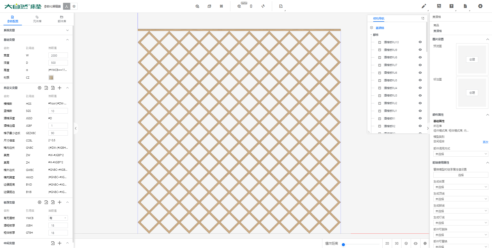

# 简介

首先这个酒格分为两类板件，高度和宽度成为一种特定的比例。

根据我们已知条件，那么我们首先得知的是，这个模型的高度或者宽度，我们只能完全自定义其中一个。

根据设计思路，宽度根据门或者其他的结构，基本已经确认，所以酒格的宽度我们一定要能设置为和柜体相关联的。

那么酒格上存在一个层板，紧密贴合也不易出错。

酒格第二个需求，根据宽度，自动计算出合适的宽度数量。高度则是根据格子的数量来定高。

第三个需求就是四周的缝隙。酒格可能不会刚刚好四周需要留缝隙，于是我们整理出来一个真宽和真高，

格子不能太小，于是我们整理出一个格内最小边长。

根据格子最小边长，求出最小的当前格子的边长。

在根据格子的边长求出格子的横向对角宽度。使用了倍率。就是根号2。

