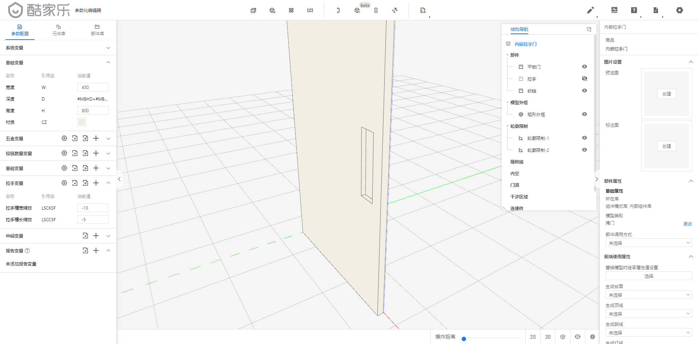
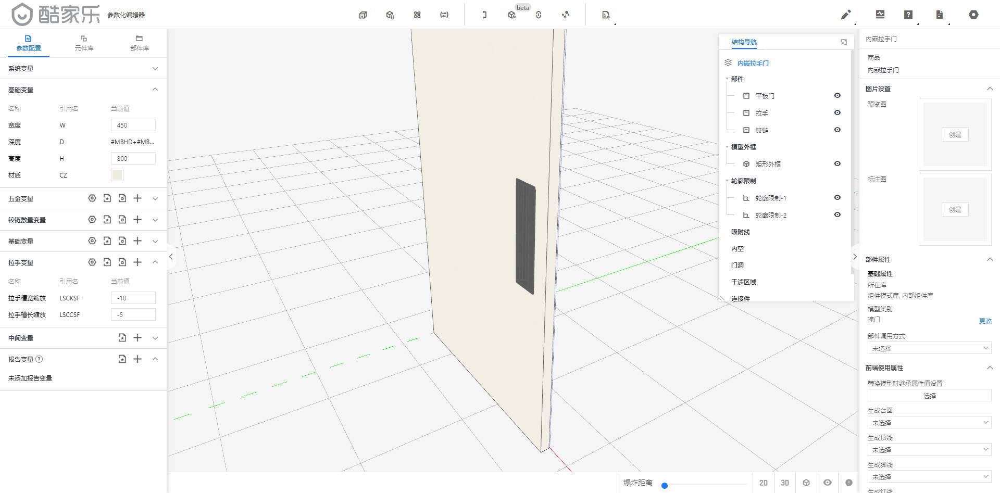
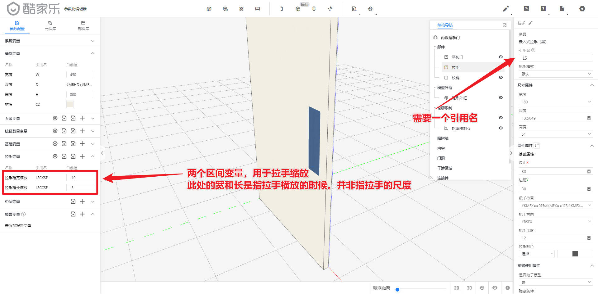
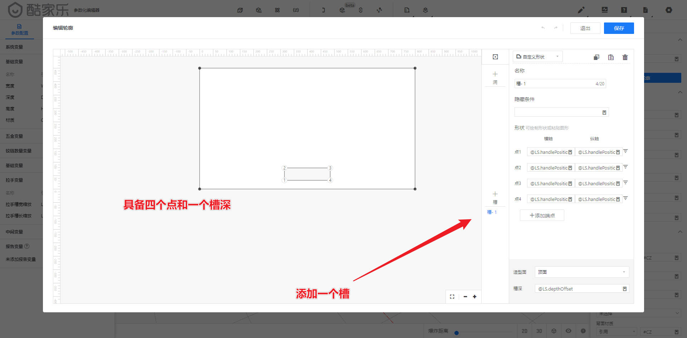
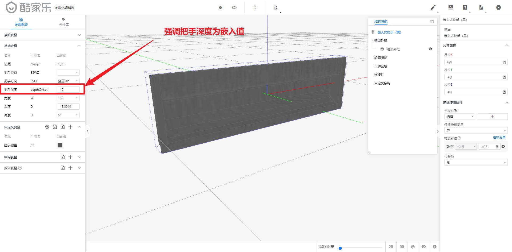

# 嵌入式拉手

嵌入式拉手如果需要仿真还原，拉手的3D模型需要搭建。

其次就是在板件相应的位置开缺。

但如果我们限制了拉手的位置及一些方向，显而易见会简单很多，但不利于替换。和前端的操作逻辑

下图是一些注意事项和简要说明

### 开凹图例

### 安装好的样子

### 变量引用及附增加变量

### 开槽的页面

### 拉手的注意事项

## 自定义参数

### 参数的说明

只记录了关键必要的参数。

正常情况下

点2的横轴与点1相同。点4的纵轴与点1相同

点4的横轴与点3相同。点2的纵轴与点3相同

思维逻辑。首先判断把手位置，然后确认方向，在结合尺寸。

把手位置为九宫格

|      | 左   | 中   | 右   |
| ---- | ---- | ---- | ---- |
| 上   | 0    | 1    | 2    |
| 中   | 3    | 4    | 5    |
| 下   | 6    | 7    | 8    |

把手模型默认为横向，否则因为参数原因，纵向会旋转90度。造成的结果是错的。

建模的思路为

拉手在左中右边时，槽的纵向（相对门板编辑）位置相等

拉手在上中下边时，槽的横向（相对门板编辑）位置相等

### 拉手变量

| 名称         | 引用名 | 参数类型 | 隐藏条件 | 最小值 | 最大值 | 当前值                       |
| ------------ | ------ | -------- | -------- | ------ | ------ | ---------------------------- |
| 拉手槽宽缩放 | LSCKSF | 区间     |          | -100   | 100    | 拉槽需要比拉手小多少就写多少 |
| 拉手槽长缩放 | LSCCSF | 区间     |          | -100   | 100    | 拉槽需要比拉手小多少就写多少 |

### 槽参数

造型面：顶面

槽深：`@LS.depthOffset`

| 名称 | 横轴                                                         | 纵轴                                                         |
| ---- | ------------------------------------------------------------ | ------------------------------------------------------------ |
| 点1  | `@LS.handlePosition==0 OR @LS.handlePosition==1 OR @LS.handlePosition==2?#H-@LS.margin.Y-(@LS.handleRotate==0 OR @LS.handleRotate==180?#LSCCSF/2+@LS.H:#LSCKSF/2+@LS.W):@LS.handlePosition==3 OR @LS.handlePosition==4 OR @LS.handlePosition==5?#H/2-(@LS.handleRotate==0 OR @LS.handleRotate==180?(@LS.H+#LSCCSF)/2:(@LS.W+#LSCKSF)/2):@LS.margin.Y-(@LS.handleRotate==0 OR @LS.handleRotate==180?#LSCCSF/2:#LSCKSF/2)` | `@LS.handlePosition==0 OR @LS.handlePosition==3 OR @LS.handlePosition==6?#W-@LS.margin.X-(@LS.handleRotate==0 OR @LS.handleRotate==180?@LS.W+#LSCKSF/2:@LS.H+#LSCCSF/2):@LS.handlePosition==1 OR @LS.handlePosition==4 OR @LS.handlePosition==7?(#W/2)-(@LS.handleRotate==0 OR @LS.handleRotate==180?#LSCKSF+@LS.W:#LSCCSF+@LS.H)/2:@LS.handlePosition==2 OR @LS.handlePosition==5 OR @LS.handlePosition==8?@LS.margin.X-(@LS.handleRotate==0 OR @LS.handleRotate==180?#LSCKSF:#LSCCSF)/2:0` |
| 点2  | `@LS.handlePosition==0 OR @LS.handlePosition==1 OR @LS.handlePosition==2?#H-@LS.margin.Y-(@LS.handleRotate==0 OR @LS.handleRotate==180?#LSCCSF/2+@LS.H:#LSCKSF/2+@LS.W):@LS.handlePosition==3 OR @LS.handlePosition==4 OR @LS.handlePosition==5?(#H/2)-(@LS.handleRotate==0 OR @LS.handleRotate==180?(@LS.H+#LSCCSF)/2:(@LS.W+#LSCKSF)/2):@LS.margin.Y-(@LS.handleRotate==0 OR @LS.handleRotate==180?#LSCCSF/2:#LSCKSF/2)` | `@LS.handlePosition==0 OR @LS.handlePosition==3 OR @LS.handlePosition==6?#W-@LS.margin.X+(@LS.handleRotate==0 OR @LS.handleRotate==180?#LSCKSF:#LSCCSF)/2:@LS.handlePosition==1 OR @LS.handlePosition==4 OR @LS.handlePosition==7?(#W/2)+(@LS.handleRotate==0 OR @LS.handleRotate==180?#LSCKSF+@LS.W:#LSCCSF+@LS.H)/2:@LS.handlePosition==2 OR @LS.handlePosition==5 OR @LS.handlePosition==8?@LS.margin.X+(@LS.handleRotate==0 OR @LS.handleRotate==180?@LS.W+#LSCKSF/2:@LS.H+#LSCCSF/2):0` |
| 点3  | `@LS.handlePosition==0 OR @LS.handlePosition==1 OR @LS.handlePosition==2?#H-@LS.margin.y+(@LS.handleRotate==0 OR @LS.handleRotate==180?#LSCCSF:#LSCKSF)/2:@LS.handlePosition==3 OR @LS.handlePosition==4 OR @LS.handlePosition==5?@LS.handleRotate==0 OR @LS.handleRotate==180?(#H/2)+(@LS.H+#LSCCSF)/2:(#H/2)+(@LS.W+#LSCKSF)/2:@LS.margin.Y+(@LS.handleRotate==0 OR @LS.handleRotate==180?#LSCCSF/2+@LS.H:#LSCKSF/2+@LS.W)` | `@LS.handlePosition==0 OR @LS.handlePosition==3 OR @LS.handlePosition==6?#W-@LS.margin.X+(@LS.handleRotate==0 OR @LS.handleRotate==180?#LSCKSF:#LSCCSF)/2:@LS.handlePosition==1 OR @LS.handlePosition==4 OR @LS.handlePosition==7?(#W/2)+(@LS.handleRotate==0 OR @LS.handleRotate==180?#LSCKSF+@LS.W:#LSCCSF+@LS.H)/2:@LS.handlePosition==2 OR @LS.handlePosition==5 OR @LS.handlePosition==8?@LS.margin.X+(@LS.handleRotate==0 OR @LS.handleRotate==180?@LS.W+#LSCKSF/2:@LS.H+#LSCCSF/2):0` |
| 点4  | `@LS.handlePosition==0 OR @LS.handlePosition==1 OR @LS.handlePosition==2?#H-@LS.margin.y+(@LS.handleRotate==0 OR @LS.handleRotate==180?#LSCCSF:#LSCKSF)/2:@LS.handlePosition==3 OR @LS.handlePosition==4 OR @LS.handlePosition==5?@LS.handleRotate==0 OR @LS.handleRotate==180?(#H/2)+(@LS.H+#LSCCSF)/2:(#H/2)+(@LS.W+#LSCKSF)/2:@LS.margin.Y+(@LS.handleRotate==0 OR @LS.handleRotate==180?#LSCCSF/2+@LS.H:#LSCKSF/2+@LS.W)` | `@LS.handlePosition==0 OR @LS.handlePosition==3 OR @LS.handlePosition==6?#W-@LS.margin.X-(@LS.handleRotate==0 OR @LS.handleRotate==180?@LS.W+#LSCKSF/2:@LS.H+#LSCCSF/2):@LS.handlePosition==1 OR @LS.handlePosition==4 OR @LS.handlePosition==7?(#W/2)-(@LS.handleRotate==0 OR @LS.handleRotate==180?#LSCKSF+@LS.W:#LSCCSF+@LS.H)/2:@LS.handlePosition==2 OR @LS.handlePosition==5 OR @LS.handlePosition==8?@LS.margin.X-(@LS.handleRotate==0 OR @LS.handleRotate==180?#LSCKSF:#LSCCSF)/2:0` |

