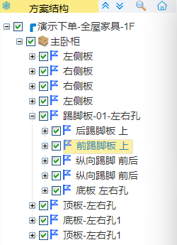

## 拆单页面

### 操作建议

如果是前端设计出错，在问题较多的情况下，建议修改前端。后端不推荐修改。

难度大，出错率高。可视化弱，并且脱离了设计框架的初衷。

### 方案结构

方案结构的作用，通过产品树，能够快速定位对应柜体及元素对象。

#### 操作技巧

双击元件快速定位

勾选/取消勾选可显示/隐藏相应的板件，五金及柜体。

按着`ctrl`+`鼠标左键`可以多选，一般用于粘贴工艺或隐藏。

#### 方案结构右键

##### 添加为部件工艺

把适配好的，可以固定的组件或柜体或板件（通常为板件）保存为工艺库。之后不需要重新为此对象添加工艺。

##### 添加为基础版

这里在CAD板件中为**特殊板件**，其实特殊板件这个称呼也确实更为贴切。

特殊板件可以设置此板件

> 纹理方向（强制）
>
> 是否不输出（设置是否输出至料单）
>
> 不碰撞出槽（设置是否可以被其他板件嵌入开槽）
>
> 薄板被动开孔（当这个板件为薄板时，是否能被打孔）
>
> 不能被动打孔（不被其他板件碰撞产生五金）
>
> 不能被动打孔面（对上方功能，指定某个面生效）
>
> 接触面也封边（有些板件在接触面不需要封边，情况极少）
>
> 备注（备注会输出到料单）

##### 查看产品ID

查看到ID之后。可以去后台搜索并设置已适配好的基础板或工艺库。

#### 上箭头按钮

快速折叠产品结构树

#### 下箭头按钮

快速展开产品结构树

#### 放大镜(按关键字搜索)按钮

快速查询

查询方法：

> [对象名称](#名称)
>
> [对象编号](#编号)

#### 房子(按房间查看)按钮

定位房间从而只显示对应房间的柜体。

### 属性信息

此处会放置选中对象所有的信息

#### 名称

对象的名称，并且在[搜索](#放大镜-按关键字搜索-按钮)功能中也可以快速查询。

#### 编号

板件唯一编号，在之后的标签和拆单后的表格里都能查询。并且在[搜索](#放大镜-按关键字搜索-按钮)功能中也可以快速查询。

#### 类型

此处会后台自动分析这个板件的类型。但是一般类型都区别不大。但是如果是门板类型的，则不会被打孔，拉槽等。

#### 位置

可以修改查阅板件的世界坐标，临时修改位置

#### 大小

可以临时修改板件的长宽高，但这个长宽高也是基于世界轴的。所以只能根据尺寸或者尝试判断。但是在这里修改的概率很小，并且也不建议在此处修改。

如果修改，相对于的尺寸是从对象中心处放缩。而不是从一边向另一边。

#### 类型（输入框）

这里可以修改当前板件类型。一般是前端使用错误的模型需要临时修改而准备的功能。主要是把门板类型换成其他类型，以开启打孔拉槽等功能。

#### 材质ID（输入框）

因为分辨率的因素，可能看起来像是材质II

这里可以获取到当前对象的材质ID。并且去后台对相应材质进行增加，删除，修改，查询。

#### 材质（输入框）

显示对应材质ID的材质名称

#### 补板（输入框）

如果此项为1（true）则进入补板列表。否则不为补板

#### 不碰撞出槽（输入框）

如果此项为1（true）则不能被出槽。否则可以出槽

#### 薄板被动开孔（输入框）

如果此项为1（true）则如果为薄板可以被打孔。否则不可被打孔

#### 不能被动打孔（输入框）

如果此项为1（true）则不可以被打孔。否则就可以被打孔

#### 备注（输入框）

这里输入的信息会被导出到料单

#### 保存按钮

以上有输入框的选项，修改之后，保存之后，在刷新之后才可以生效。

#### 下方显示栏

因为内容项目太多，并且不可修改，所以就不在阐述。可以结合上方综合判断。

### 主页面操作

#### 透视视图切换

选择可以把所有板件材质透明，可以快速观测线条或五金。

#### 爆炸视图切换

选择可以进入爆炸视图。

#### 碰撞分析

板件的碰撞检测分析。

#### 一键拆单

点击之后拆单。一般为审单的最后一步操作。

#### [更多操作选项](#更多操作选项-1)

此项目内容过多，单独讲解

#### [右键](#右键-1)

此项目内容过多，单独讲解

### 更多操作选项

里面有很多选项，并且会随着之后的更新，有可能增加选项。

#### 五金碰撞

五金之间相互的碰撞。但是碰撞检测机制是五金的最大轮廓的立方体为检测体积。

也可以根据不同五金的设置而屏蔽检测。

#### 孔槽碰撞

打孔的五金和拉槽的五金及板件拉槽的重叠检测

#### 五金规避

在以上两种碰撞的时候，会自动规避16的倍数距离

::: tip

为什么是16？因为默认32的情况下，避让距离过大，与另一个五金的碰撞的概率会更大，也可能会因为窄条的宽度不够宽。而无法规避。16的偏置也比常规的五金最大孔径大一些。并且也是32的1/2。

:::

#### 漏孔检测

如果两个板件之间可以打孔，但是没有出孔。可以检测出来提醒。

但如果板件之间有间距，则不能被识别。这种概率极小，并且出现在手动编辑轮廓的可能性才是最大的。

#### 漏边检测

存在没有封边的边。会做出提示。

#### 应用通用工艺

快速的根据企业的设置的工艺对相应柜体进行快速适配工艺

#### 隐藏所有门板

隐藏门板类别的板件。从而更方便观测

#### 显示材质颜色

如果企业材质有设置后台，则能够做材质区分。但是因大部分企业的材质统计不完整或材质更迭较快。所以适配的情况可能不尽人意。但基本不影响。

#### 显示纹理方向

会在板件上显示出一根红线，做纹理的显示。但是实际情况下，纹理必然存在纹理。只是不区分方向的纹理。所以无纹理的材质，也依然会显示纹理。这里不影响。

#### 酷家乐设计

在企业选购酷家乐有API接口的用户，这里可以跳转回酷家乐。

#### 查看补板清单

在右键[添加为补板](#添加为补板)的板件，一个已选补板板件的整体清单。

::: tip

补板的机制是提供下载筛选，并不具备修改工艺的功能。 

如果修改了工艺，单独操作补板无效。需要拆单之后，下载补板料单。

:::

#### 用料分析

新功能：

在正常情况下，拆单之后才知道我们已经使用的材质、封边、五金。但是具备这个功能，可以提前列出已用的物料清单。从而自行排查。

#### 尺寸超限板材检测

新功能：

在后台数据中，可以提前预设好相应材质的尺寸，可以使用这个检测，避免板材超过原材料尺寸。

---

### 右键

在左键选择对象之后，鼠标右键单击弹出右键菜单。

#### 隐藏板件

快捷键`H`，也可以勾选[方案结构](#方案结构)

#### 参考方向

需配合[置为自动AB面](#置为自动ab面)

> 参考方向置为A
>
> > 五金打孔，把开孔面换为A面。
> 
> 参考方向置为B
> 
> > 五金打孔，把开孔面换为B面。

#### 置为检测漏孔

> 置为不检测漏孔
> > 临时修改指定板件不检测此板件漏孔
> 
> 置为检测漏孔
> > 临时修改指定板件检测此板件漏孔（默认）

#### 设置侧边相连

> 设置侧边不相连（默认）
> > 临时修改指定板件侧面不相连
> 
>  设置侧边相连
> > 临时修改指定板件侧面相连

#### 置为自动AB面

> 置为自动AB面（默认）
> > 临时修改指定板件孔位自动AB面翻转
> 
>  置为不自动AB面
> > 临时修改指定板件孔位不自动AB面翻转

#### 置为单饰面

无默认，如有指定单饰面板。建议勾选。会影响打孔或者异形开料。

> 置为单饰面A
> > 临时修改板件为单面饰面板，饰面在A面
> 
> 置为单饰面B
> > 临时修改板件为单面饰面板，饰面在B面
> 
> 取消单饰面设置
> > 取消则为双饰面设置

#### 改变纹理方向

点击生效，纹理旋转90度。[建议](#操作建议)

#### 添加为补板

点击添加。进入[查看补板清单](#查看补板清单)

::: tip

补板的机制是提供下载筛选，并不具备修改工艺的功能。 

如果修改了工艺，单独操作补板无效。需要拆单之后，下载补板料单。

:::

#### 复制工艺

复制当前指定板件的工艺

切换五金，例如三合一换二合一[建议](#操作建议)

#### 复制材质

复制当前指定板件的材质[建议](#操作建议)

#### 粘贴工艺

只有在复制工艺之后显示

::: tip

当前未选中板件，请选择板件！ 

是因为和复制材质一同使用了，需要重新复制

:::

粘贴刚才的工艺到现在选择的板件

>[x]拷贝[布置方案](#布置方案)
>
>[x]拷贝[外部五金](#外部五金)
>
>[x]拷贝[封边](#封边)
>
>勾选项才能粘贴

#### 粘贴材质

只有在复制材质之后显示

粘贴刚才的材质到现在选择的板件

### 提示窗口

在各种检测分析时，会弹出各种窗口

不同颜色的报警，严重程度不同。但不同检测的颜色也不同。

**双击对应的警报或提示，可以快速定位报警提示的位置。**

#### 板件碰撞

板件之间的碰撞情况[建议](#操作建议)

无提示则无碰撞

##### 红色不出槽

板件之间的交叠。一般为两个模型重叠部分

##### 紫色出槽

板件之间产生了超宽的槽。一般只有薄板才出槽

##### 绿色出槽

两个板件互相出凹型开缺，相互锁紧，一般都是酒格槽。

##### 蓝色出槽

背板和普通板件的槽。

#### 五金碰撞

无提示则无碰撞

#### 孔槽碰撞

无提示则无碰撞

#### 漏孔检测

无提示则无漏孔

#### 漏边检测

无提示则无漏边

### 工艺栏

在选中板件之后，右侧会弹出灰色部分的工艺栏。

#### 布置方案

可以针对某个点至另一个点的五金配置

##### 布置方案

可以观察当前的配置详情

##### 显示匹配

可以显示当前适配好的五金，如果不显示，则没有相对于尺寸的配置

##### 布置方向

在前后不对称配置的情况下，可以前后调头。

##### 参考方向

五金的孔位朝向调整

但这里存在工艺库的情况下，优先工艺库。

通用工艺的情况下，优先适配高度来自动区分AB面。

##### 操作

> [+]
>
> > 新增一组工艺库
>
> [-]
>
> > 删除对应边所有工艺
>
> 删除
>
> > 删除对应边指定工艺

#### 外部五金

可以针对某个点至另一个点的单独的五金配置

##### 操作

> [+]
>
> > 新增一个五金
>
> [-]
>
> > 删除对应边所有五金
>
> 删除
>
> > 删除对应边指定五金

##### 五金

可以观察当前的五金详情

##### 起点距离

根据板件的面显示点，选择五金距离起点的边距。

##### 距边

这里一般不填写

这里一般为五金距离侧面（两个点所对应的面）的距离

##### 参考方向

五金的孔位朝向调整

#### 封边

可以针对某个点至另一个点的封边配置

##### 封边

预览当前选择的封边信息

##### 操作

> 配置上次封边
>
> > 快速添加之前操作过的封边
>
> [+]
>
> > 添加封边
> >
> > 点击之后弹出选择窗口的按钮
> >
> > > 配置到当前封边
> > >
> > > 配置到该板件的所有封边
> > >
> > > 配置到所有板件的所有封边
> > >
> > > 关闭
>
> [-]
>
> > 删除指定边的所有封边
>
> 替换
>
> > 替换当前选中封边
> >
> > 点击之后弹出选择窗口的按钮
> >
> > > 替换该柜体该类型封边
> > >
> > > 替换该柜体才值班的该类型封边
> > >
> > > 替换所有该材质板件的该类型封边
> > >
> > > 替换该类型封边
> > >
> > > 替换所有板件的所有边
> > >
> > > 关闭