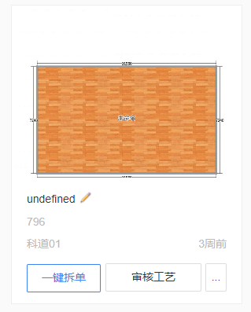
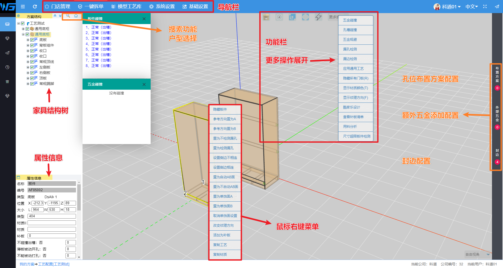
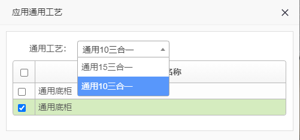

# CAD拆单后台介绍

## CAD版本界面介绍

### CAD导航栏/二级导航栏

页面释义

> **门店管理**
>
> > 工作台
> >
> > 意向单
> >
> > 订单管理
> >
> > 财务审核
> >
> > 售后服务
> >
> > 门店基础配置
> >
> > 店员管理
> >
> > 客户管理
> >
> > 单元柜价格

> **一键拆单**
>
> > 我的方案
> >
> > 总方案
> >
> > 生产订单
> >
> > 用户拆单设计
> >
> > 回收站
> >
> > 板件查询

> **模型工艺库**
>
> > 模型库
> >
> > 工艺库
> >
> > 五金库
> >
> > 放样库
> >
> > 封边库
> >
> > 基材库
> >
> > 贴图库
> >
> > 造型库
> >
> > 特殊板
> >
> > 物料编码映射
>

> **系统设置**
>
> > 工厂相关配置
> >
> > 账号生产配置
> >
> > 钻头铣刀配置
> >
> > 生产订单步骤
> >
> > 通用工艺
> >
> > 工厂门店管理
> >
> > 通用计价规则
> >
> > 部件计价规则
> >
> > 板件/部件适配规则

## 快速拆单

首先我们从设计部分拿到我们的设计文件，一般是设计软件导出的JSON格式的文件。

之后按照下方的顺序进行操作检测。

::: tip

操作灵活掌握，基本操作顺序不变。但仍然存在部分人为解决的情况。

:::

## 导入文件

在**一键拆单**页面顶部找到**JSON**文件的导入窗口，选择我们的JSON文件。并且点击上传。

之后系统会自动创建一个方案。

如图：

我们可以点击上面的笔图标，修改方案名字。

一键拆单操作可以直接拆单。但是没有审核，拆单的错误不可观测。

## 审核技巧

首先我们观察审核主窗口

我们进入页面，等待加载完成，弹出碰撞检测之后。会看到类似于下图的页面。因为培训需要，尽可能的展示最多的窗口。部分窗口需指定操作才可显示。

> 视图操作：双击左侧结构树的板件或者双击主页面的板件可以快速定位视角中心至页面中心。

> 五金审核：在快捷键**Q**的配合下，可以切换透视图，**重点观测孔位密集的地方更容易检测出问题。**

> 修改五金：修改**布置方案**，选择更合适当前情况的布置方案，或者删除布置方案，在外部五金内添加可以独立使用的五金。

> 封边：在添加封边时可以快速给到所有板件封边。

> 复制工艺：在配置好一个部件工艺之后，如果有存在其他板件与此板件几乎相同的话，则鼠标右键复制工艺。并且选择需要粘贴的板件（长按Ctrl可多选），鼠标右键粘贴工艺。可以快速复制工艺。

> 孔位方向：鼠标右键修改参考方向置为A/B。如果修改无效，则修改**置为不自动AB面**即可生效

> 隐藏板件：定位板件后左侧结构树取消勾选隐藏，勾选显示。

> 搜索：结构树顶部的放大镜，可以搜索ID，名字等。找到相关的五金或者板件。

> 户型审核：点击搜索旁边的房子图标，可以弹出房间列表。点击房间则会仅显示此房间内的柜体。
>
> 如果出现**_xxx**的户型名称，则为前端的柜体组。

> 如果板件存在**蓝色边缘**。那么此板件则是**造型类别**的。
>
> 造型类别的并非绝对是造型类别，通常这里不在我们的加工范围或者不可成为数控生产线可加工的范围。
>
> 一般是外协外购等第三方生产的类别。

## 审核工艺

导入之后的操作环节属于审核环节。在打开审单页面之后，稍等片刻，即可弹出五金碰撞和板件碰撞的监测结果。

::: warning

如果板件出现红色警报或者紫色警报，一般是柜体产生了不必要的碰撞交叉。

在板件碰撞的最末尾，出现浅蓝色的酒格槽，需确认是否真的存在。

鼠标左键双击板件碰撞的信息可以快速定位至检测位置。

:::

### 用料分析

我们进入界面的第一个操作是用料分析。分析当前订单的原材料及五金。

在功能栏的更多操作里找到用料分析，并点击

::: tip

用意：初步筛选出非常规的原材料。例如出现了**超厚的板件**，**不应出现的五金**，**不标准不规范的材质**

出现这种情况应第一时间联系对应设计师进行设计排查修改。

:::

### 尺寸超限检测

检测板件是否超过我们后台设定的原材料的尺寸。

::: tip

需要先设置好企业内部的材质库和对应的原材尺寸

:::

### 应用通用工艺

在功能栏的更多操作里找到应用通用工艺，并点击。弹出下方窗口

使用方法，选择工艺，并且选择应用该工艺的柜体。

::: tip

如果出现多种工艺在同一个订单，需要重复此操作，对不同工艺配置不同的五金。

:::

### 五金碰撞/孔槽碰撞

操作同上

点击后会出现检测结果窗口。人工快速筛查相关结果是否存在结构问题。

如果是正常的碰撞，则下一步操作

::: tip

正常碰撞：一般是对穿孔或者在具备规避空间的情况下。并且不影响安装的打孔方案，则可以自动规避。不需要单独操作。

:::

::: warning

不需要打孔的基本判断：

1. 一个板件的某个边，如果被打孔了，则不可向其他板件打孔。
   * 例如：底托侧的底板，被自身侧板打孔了，但是侧面相邻了一个竖板，底板会向相邻的竖板打孔。这种情况下，不可让底板向其他竖板出孔了。
2. 两个柜体之间，通常不主动产生孔位进行链接。
   * 例1：吊柜的底板在地柜的侧板之上，地柜不可向吊柜的底板出孔。
   * 例2：多个柜体相邻，相互之间不产生孔位。（因为多个柜体如果链接上了，则常规情况下，人力无法安装这么庞大的完整的柜体组。通常是分成独立柜体安装。）

:::

### 五金规避

五金规避是在上述操作之后才可操作的，并且不可逆。

系统会自动的规避可规避的所有五金。避让间距默认为16㎜。

### 漏孔检测/漏边检测

检测是否存在没有孔但可以打孔的边。但一般需要和五金碰撞功能结合。

检测是否存在没有封边的板件。

## 一键拆单

上述检查如果通过之后。点击一键拆单。则进入自动拆单。

点击最上方导航栏的一键拆单，进入方案页面。对应方案会出现拆单数，点击拆单数，进入拆单记录列表，点击对应拆单记录的**下载报表**。在点击下载报表。即可下载该方案的主要信息。

## 报表讲解

### 开料板件清单

所有需要车间加工的板件的信息都在这个表里。

### 原材料汇总表

所有板材，封边，五金等均在这里显示

### 五金配件清单

单独展示五金并且细致展示

### 产品列表

此订单所有产品

### 订单信息

此订单的基础信息

### 造型类（可选）

造型类的表

### 开料造型类（可选）

可加工的开料造型类别

