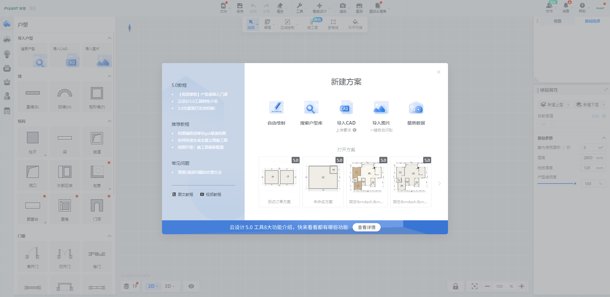
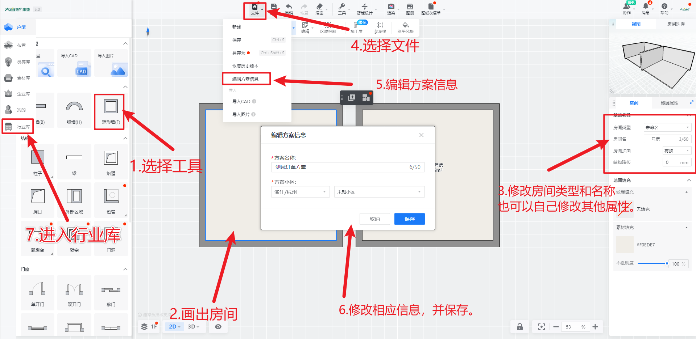
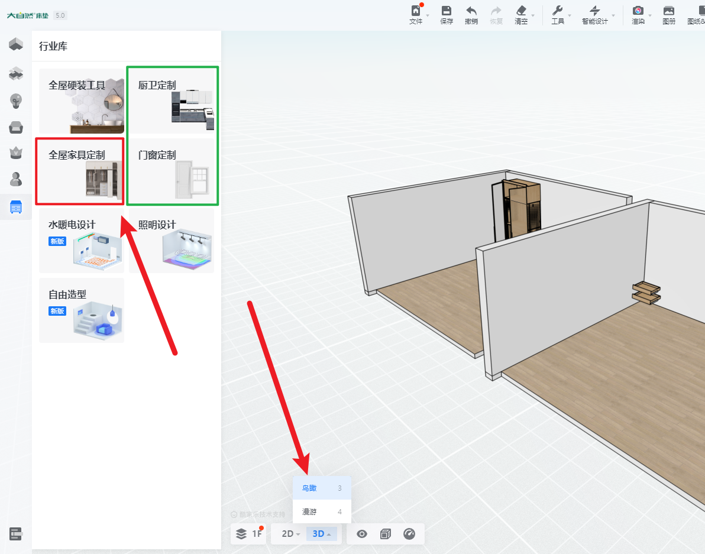
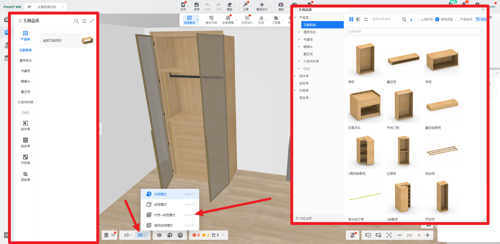
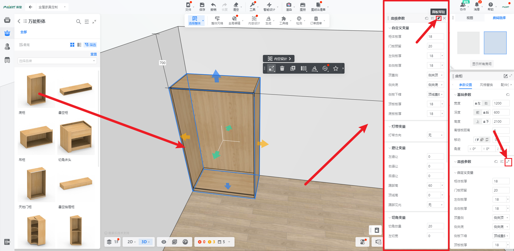
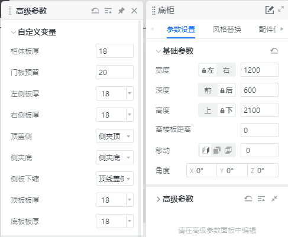

## 准备工作

### 账号软件准备

1. 准备一个拥有企业模型库的前端账号
2. 拥有一套企业模型库。企业模型库申请可以联系作者(右上角联系)。
3. [todesk远程软件](https://www.todesk.com/download.html)，~~[向日葵远程](https://sunlogin.oray.com/)~~（todesk优先）
4. [Chrome浏览器](https://www.google.cn/chrome/index.html)

### 硬件准备

1. 一台主流游戏性能的电脑
   - 核心硬件推荐。
   - 推荐CPU为R5或者I5以上最新一代CPU
   - 总内存推荐为DDR4以上，16G以上，3200以上的多根内存条。
   - 显卡推荐为1060以上
2. 网络设备，软件全程联网。
   - 手机热点也可以

### 知识储备

1. 电脑基础常识。
   1. 文件路径
   2. 电脑管理
   3. 应用下载
   4. 文件的复制，粘贴，移动，修改。查询操作。
2. 设计常识标准
   - 这里计划做一个统一的标准，后续会更新文章提供。

## 创建项目及画图

### 进入软件主页

接着，我们根据需求选择，一般都是自由设计

按照下图顺序操作。即可快速进入定制页面。

进入全屋定制页面。并且切换为3D显示模式。

进入之后，我们需要认识下页面及配置下窗口

进去之后，有个主商品库有左右两种样式，这个是根据企业习惯来定义的，但使用方式本质上没有不同。

显示模式非常建议切换为材质+线框。

现在就可以从主商品库里面，拖入模型随意测试了。

### 认识柜体

拖入柜体，选中柜体，柜体边框呈蓝色。右侧出现参数。

现在我们构建好了第一个柜体，因为是企业库模型，这个模型具备了非常丰富的参数。

一般我们称之为这种柜体为万能柜体。它基本一个柜体就能满足日常设计家装中的绝大部分的情况。

下一步。我们可以认识参数

### 认识参数

根据上图，我们看到了两个参数，一个是基础参数，另一个是高级参数，

基础参数中，有[尺寸](../theory/数据原理.md#尺寸篇)参数，也有[位置](../theory/数据原理.md#位置篇)参数和[角度](/theory/数据原理.html#旋转篇)参数。可以自己尝试下右侧的基础参数。

> **基础参数几乎是统一的**

高级参数

> 我们需要认识的主要内容就是高级参数，高级参数一般是企业所规范的适用于自身体系的参数框架。
>
> 这里一般会尽可能的能从名字阅读到底层数据。
>
> 如果你是企业工艺的制定者，那么为了满足不同的需求，可能你会开放非常多的参数给前端，方便设计师在不同情况下灵活拓展。
>
> 但是我个人并不是很推荐这样做。优点确实是显而易见，缺点就会造成参数的冗杂。
>
> > 如何解决？
> >
> > - 规范标准使用规范。
> > - 规范五金品牌和类别。
> > - 减少过度定制化。
> >
> > 规范标准指定好之后，设计师主动定制内容就适当减少了。从而减轻设计师的压力。
>
> 
>
> > 五金越多，品类参数越多，导致的生产工艺差异越大。
> >
> > 过度的不必要的定制化，会给企业带来过多的定制比例。
> >
> > 小众的需求永远不能成为快速的标准。
> >
> > 小众的需求，可以开发一个新的系列，例如[高定]部分的内容.
> > 
高定: 高端定制，根据潮流的高难度定制设计。

---

### 认识组件

家具设计，一般分为两个重要的组合部分。

[柜体部分](#认识柜体)  及  组件

组件一般是这个结构能自成一体的，简化使用的板件组合，或者单一板件。

例如抽屉就是最为经典的组件之一。

我们先随意拖入一些组件。

图片加载或许需要时间。需要耐心等待一下。

操作步骤

> 1. 拖入层板
> 2. 拖入门板，调整门板布局，切分门板，打开门板。
> 3. 拖入五金
> 4. 拖入门内抽屉所需的避让组
> 5. 拖入抽屉。

这样就具备了一个设计的基本操作。

所有的设计都是拖入[柜体]在把[组件]拖入完善柜体。即可完成初步设计。

柜体: 柜体类别，书桌，榻榻米也为柜体类别

组件: 柜体类别内的空间填充结构
