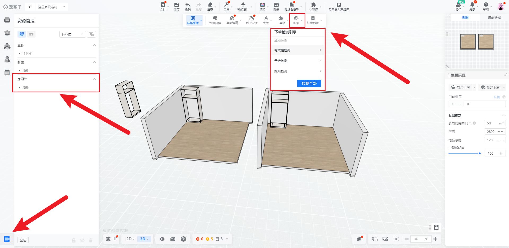
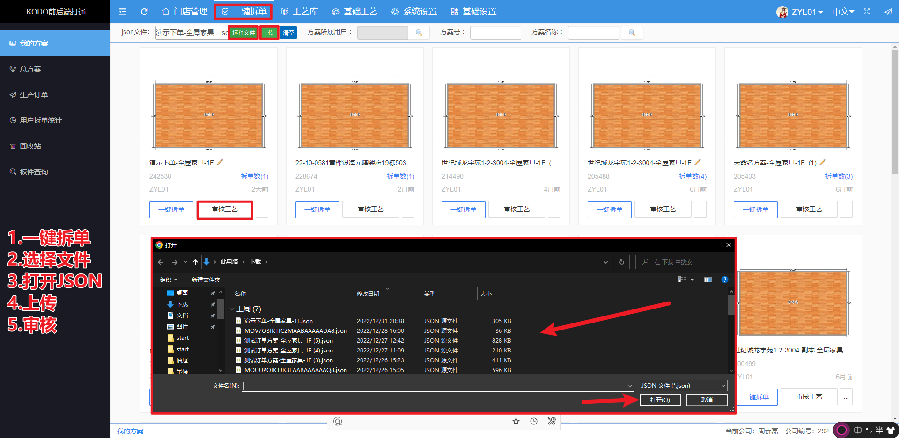
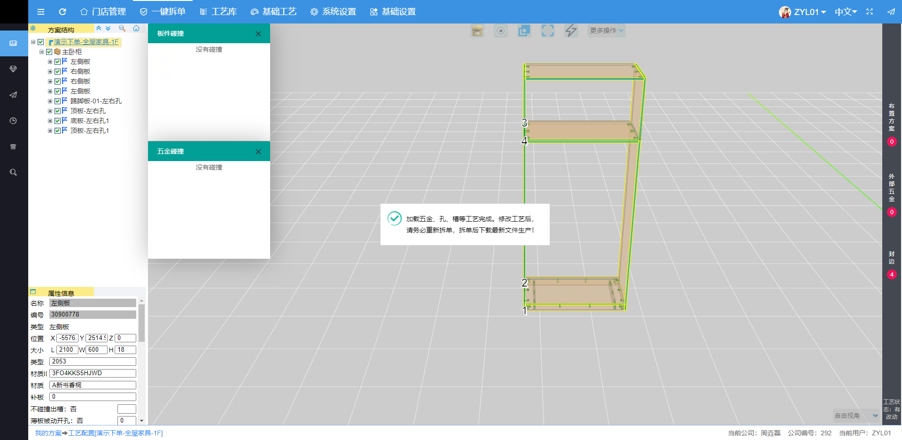
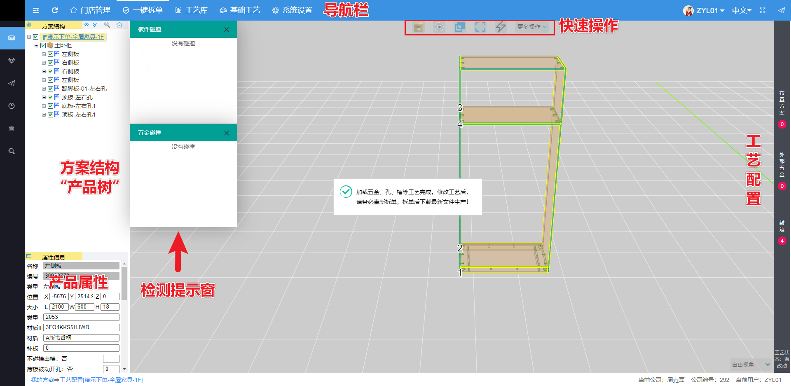
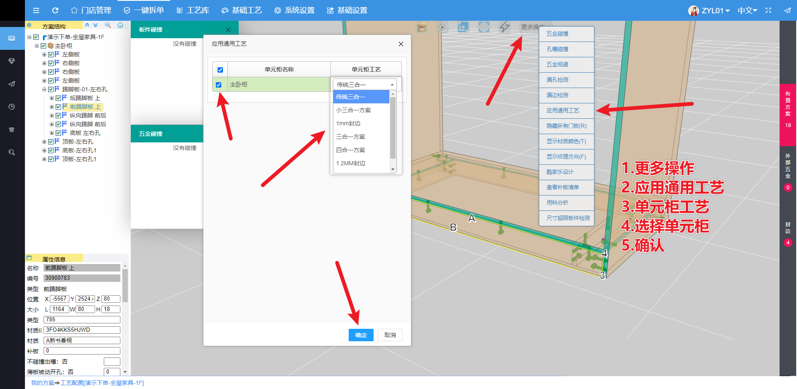

# 流程简解
## 设计部分

### 进入设计工具

我们可以在[首页](https://www.kodocode.cn/)进入[酷家乐](https://www.kujiale.com/)

按照[初步了解](../start/初步了解.md#创建项目及画图)的流程进行初步的设计。

[设计案例]()

### 检查

在设计完成之后。我们进入初步的检查。

重点检查**是否有户型外的家具**。

否则会导致多出来不必要的柜体。产生不必要柜体和板件

检测

1. 规则检测
   - 为指定的特殊模型达到某些条件提示的报警
2. 有效性检测
   - 模型版本老旧
   - 模型已被删除
3. 干涉检测
   - 模型之间相互碰撞交叉

否则会导致多出来不必要的柜体。产生不必要柜体和板件

### 下载数据文件（JSON）

设计师在设计界面。

点击上方靠左的文件按钮

在导出选项中，选择对应的JSON导出

每次导出时，建议重新生成并下载。

**如果没有重新生成，则此次JSON文件是之前的生成的，JSON文件不包含最新修改的内容。**

导出JSON的注意点

> 在房间选择里，选择了指定房间，也可以导出指定房间的JSON
>
> 可以选择楼层导出JSON
>
> 可以选择整个方案导出JSON

::: warning

注意：目前无法同时导出一个具备【厨卫】【全屋家具】【门窗】一体的JSON文件

:::

::: warning

**如果下载的JSON文件体系大于35MB，建议把订单拆分制作。因为这个会提高错误率和修改成本。并且会导致因数据过大，造成的过载。以至于无法正常运行网页。**

:::

## 快速解析下单

进入王石软件，王石软件分为[DS版本](https://ds.wongshek.cn/a)和[CAD版本](https://cad.wongshek.cn/a)，基本使用没有什么区别。细节上存在一些逻辑上的区别。但需要注意已经购买的版本，不同版本之间的账号不可互通。并且2023年之后会以CAD版本为主。

### 快速导入解析

点击上方的`一键拆单`跳转入我们对应账号的方案列表里。

上方有个JSON文件的输入窗口并且有一些筛选工具。

点击`选择文件`进入文件选择窗口，选择我们之前下载好的JSON文件。并点击`上传`按钮。

下方就会出现对应JSON文件名称的方案，点击`审核工艺`，进入审核页面。

### 审核页面操作

审核页面内容极多。

上方一行为`导航栏`，左侧为`方案结构`和`属性信息`右侧为`工艺配置`中间主窗口是审核窗口

### 快速适配工艺

通过`更多操作`里面的`应用通用工艺`，可以快速对相对的柜体快速适配已经设置好的工艺库。

操作如图

注意：单元柜工艺的选项会根据每个公司的工艺不同而有不同的选项。

### 一键拆单

在`更多操作选项`的左侧，有一个一键拆单的按钮。在检测之后确认无误之后。点击一键拆单可以进行自动拆单。
