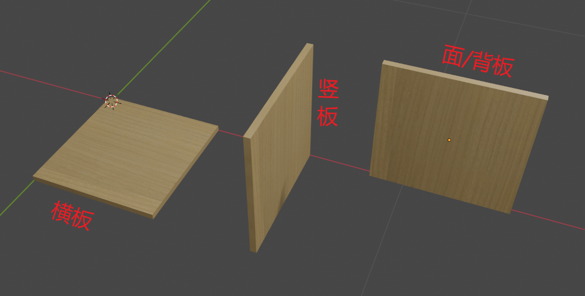
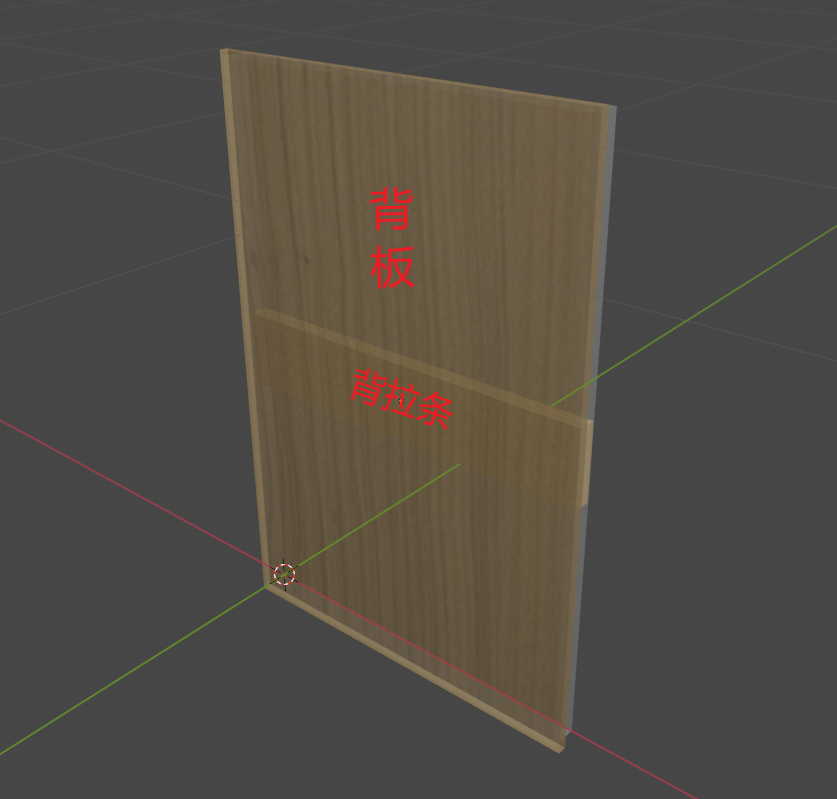
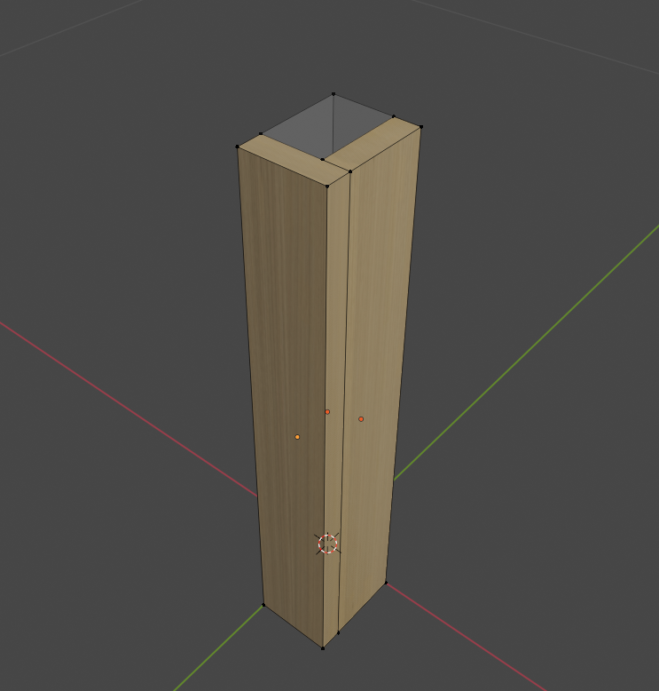
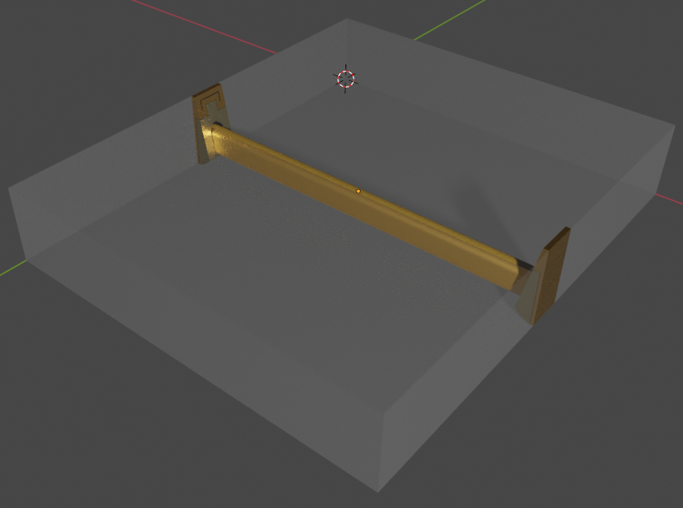

# 结构解析

柜体结构及内部组件或边框组件的讲解介绍

## 板件解析

板件比较基础。但是一般具备三种摆放方式

一般一个订单百分之99都是这种板件，还有极少数的具备其他角度的板件。

> 横板类常用板件
>
> 顶板
>
> 底板
>
> 层板

> 竖板类常用板件
>
> 左侧板
>
> 右侧板
>
> 中侧板

> 面/背板类常用板件
>
> 门板
>
> 背板
>
> 隔板

## 柜体解析

一个常规的柜体一般具备如下图一样的结构

- 左/右侧板：面对柜体，位于左/右方的竖板。

  - 基本的支撑功能。
  - 对应方向密封及美观作用。
- 顶板：位于顶部的横版

  - 连接柜体的两个侧板的顶部
  - 基本的链接作用
  - 固定背部板件的功能
  - 对应方向的密封及美观作用。
- 底板：位于底部，连接柜体底部。

  - 连接柜体的两个侧板的底部
  - 基本的链接作用
  - 固定背部板件的功能
  - 对应方向的密封及美观作用。
- 背板：位于背部
  - 支撑柜体内部结构
  - 对应方向的密封及美观作用。

::: tip 密封：密封具有组合粉尘，昆虫，返潮等作用。
背板后方存在后拉条，一般独立为背板组件 :::

::: warning 这里是黄色警告  :::

::: danger 红色警告 :::

## 组件结构

> 组件具备几个基础条件
>
> 1. 组件必须放置在一个空间内
>    - 例如柜体的某个空间内放置抽屉
>    - 柜体内的衣杆，在柜体内部的空间
>    - 收口，踢脚等，也是在柜体单元内或者外部产生一个空间才能正常使用。
>
> 2. 组件具备一个空间以和放置的空间做关联
>    - 抽屉的空间和柜体的空间的`宽度`及`深度`会有一个基础的关联关系
>
>    - 背板等组件，会穿越空间盒子大小。以达到嵌入的效果。
>
>      
>
>      **空间在之后的模型示图中都是灰色透明的方块**
>
> 3. 组件内必须具备一个以上的板件或五金。
>    - 无内容的组件会给维护和设计带来不必要的麻烦
>    - 没有内容的组件也没有任何意义。
>
> 4. 组件具备一个基础的正面方向
>
>    - 任何组件都具备一个立方体空间盒子（box）
>
>    - 默认摆放时，盒子的Y-方向为正面，了解[空间](https://wd.kodocode.cn/start/%E6%95%B0%E6%8D%AE%E5%8E%9F%E7%90%86.html#%E7%BB%B4%E5%BA%A6%E5%85%A5%E9%97%A8)规范。
>    - box用于放置指定空间内，空间和组件的关系。

以下提供集中常见的组件作为参考

### 组件结构——抽屉组件

常规抽屉结构

- 抽面
  - 装饰作用
  - 可加锁，可加拉手等五金
  
- 左/右抽帮

  - 支撑抽盒
  - 挂载滑轨五金
  - 固定抽底

- 前/后抽堵

  - 支撑抽盒
  - 固定抽底
  - 前抽堵可挂载抽面
  - 前抽堵根据工艺可取缔（但不建议）

- 抽底

  - 支撑抽盒结构
  - 抽屉内部置物
  - 美观作用
  - 托底轨支撑

- 滑轨

  > 三节轨
  >
  > - 抽屉伸缩作用
  > - 链接抽屉到相关空间
  > - 悬挂抽屉
  >
  > 托底轨
  >
  > - 抽屉伸缩作用
  > - 链接抽屉到相关空间
  > - 悬挂抽屉
  > - 隐藏滑轨

- 适配空间

### 组件结构——背板组件

常规背板组件

- 背板
  - 支撑当前的对角线
  - 背部空间密封
- 背拉条
  - 支撑背板，防止变型
  - 对柜体中间部分起到拉力作用。

### 组件结构——收口组件

用于柜体靠墙部分与墙面做美化用途的组件

下图是一种常规L型收口之一。

- 见光板

  见光板在很多结构中都存在

  - 位于在正常情况下，在柜体外表的部分
  - 与门板材质相同，美化柜体
  - 部分设计与门板不同，但同样美化柜体

- 支撑条

  很多结构中也常有，一般作为一个无法独立放置的板件中，起到连接或支撑作用。

  - 位于内部不可见部分
  - 支撑并连接见光板

### 组件结构——五金组件

五金组件一般有灯带，衣杆，拉篮等

下图演示一个衣杆组件

五金组件最主要的是空间适配的运用。

衣杆一般位于所添加空间前后（Y）方向的居中位置。

衣杆一般顶到左右两侧，上下位置则根据实际情况调整，上方一般保留100以内的高度。
