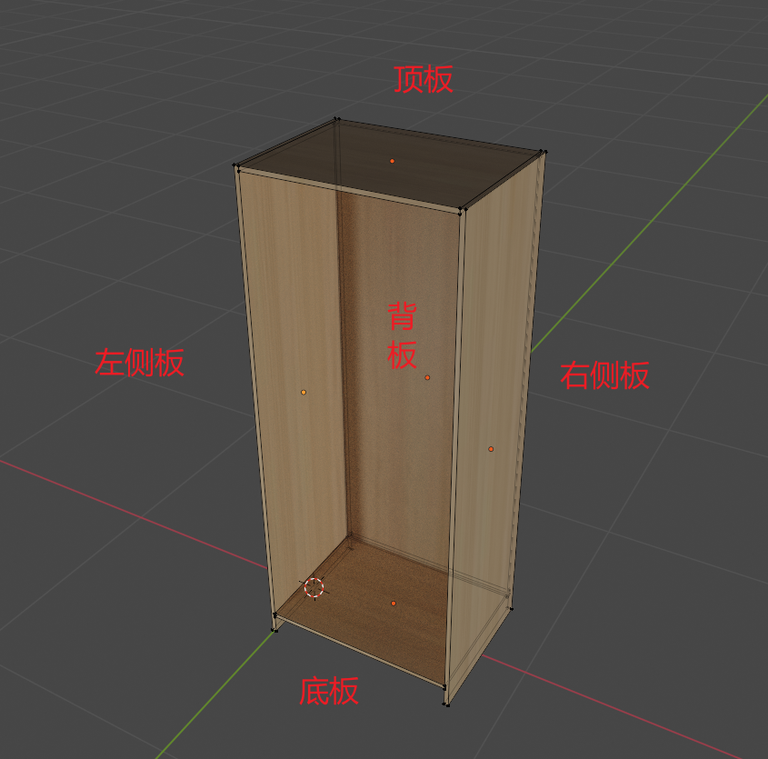
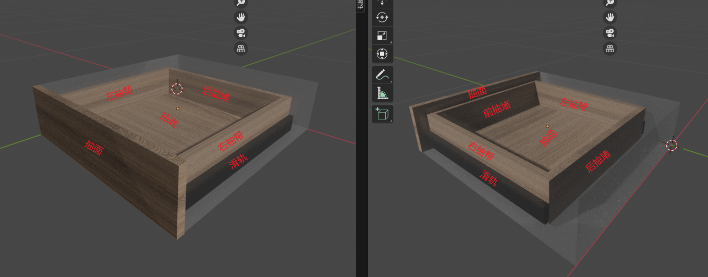

## 结构解析

柜体结构及内部组件或边框组件的讲解介绍

### 柜体解析

一个常规的柜体一般具备如下图一样的结构

- 左/右侧板：面对柜体，位于左/右方的竖板。

  - 基本的支撑功能。
  - 对应方向密封及美观作用。
- 顶板：位于顶部的横版

  - 连接柜体的两个侧板的顶部
  - 基本的链接作用
  - 固定背部板件的功能
  - 对应方向的密封及美观作用。
- 底板：位于底部，连接柜体底部。

  - 连接柜体的两个侧板的底部
  - 基本的链接作用
  - 固定背部板件的功能
  - 对应方向的密封及美观作用。
- 背板：位于背部
  - 支撑柜体内部结构
  - 对应方向的密封及美观作用。

注：

> 密封：密封具有组合粉尘，昆虫，返潮等作用。
>
> 背板后方存在后拉条，一般独立为背板组件

### 组件结构—抽屉组件

常规抽屉结构

- 抽面
  - 装饰作用
  - 可加锁，可加拉手等五金
  
- 左/右抽帮

  - 支撑抽盒
  - 挂载滑轨五金
  - 固定抽底

- 前/后抽堵

  - 支撑抽盒
  - 固定抽底
  - 前抽堵可挂载抽面
  - 前抽堵根据工艺可取缔（但不建议）

- 抽底

  - 支撑抽盒结构
  - 抽屉内部置物
  - 美观作用
  - 托底轨支撑

- 滑轨

  > 三节轨
  >
  > - 抽屉伸缩作用
  > - 链接抽屉到相关空间
  > - 悬挂抽屉
  >
  > 托底轨
  >
  > - 抽屉伸缩作用
  > - 链接抽屉到相关空间
  > - 悬挂抽屉
  > - 隐藏滑轨
