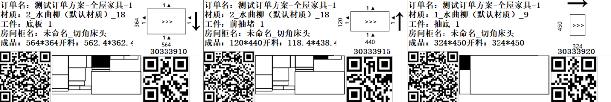
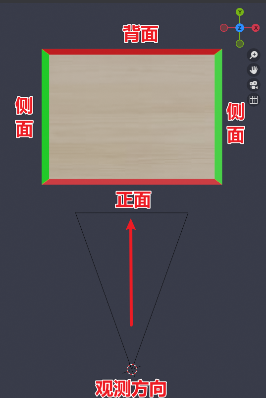

# 板件基础

## 尺寸对应方向

::: tip

默认情况下，板件均为横纹。如图所示，板件在平放的情况下，纹理是左右方向**（横纹）**

而其他板件其实都是根据横板旋转而来。这里可以参考维度说明内的内容。

为了避免横竖概念容易混淆。之后的**横纹**在之后的常规称呼中，会被称之为**顺纹**

:::

> **长度**
>
> > 红色面
> >
> > 特征：面朝观测者
> >
> > 

> **宽度**
>
> > 绿色面
> >
> > 特征：正常情况下无法观测

> **高度(厚度)**
>
> > 材质面
> >
> > 特征：不为切割面

::: tip

因为这个特征。所以在正常情况下，长度一般为面朝人的这个面。

也可以根据纹理方向来判断长度方向。

::: warning

**长度并非特指比较长的边，而是指某个方向。**

如果是顺纹，那么长度与纹路方向为平行关系，宽度与纹路方向为垂直关系

如果是逆纹，那么长度与纹路方向为垂直关系，宽度与纹路方向为平行关系。

:::

## 解析案例

一般第一个尺寸对应的是我们的长度方向，而长度方向不论纹理如何。始终是面对观测视角的

所以一般在打印的标签上，第一个尺寸数值，一般为长度。

图例

从左至右，分别为123号标签

::: tip

成品后面对应的分别是长和宽

右上角>>>是纹路方向

右上角的黑色箭头**→**为正面方向。

判断是否横纹的方法就是根据正面方向和纹路方向是否属于同一根方向轴，如果相同则证明是逆纹，如果垂直交叉，则为顺纹理。

:::

> 一号标签
>
> 长：564			宽：364
>
> 纹路方向：顺纹

> 二号标签
>
> 长：120			宽：440
>
> 纹路方向：顺纹

> 三号标签
>
> 长：324			宽：450
>
> 纹路方向：逆纹

## 封边规则

::: tip

得知纹理的好处：

如果掌握了纹理，那么封边的顺序也能确认下来了。封边优先封侧面，然后再封正面。以达到最好的美观程度

（根据正面朝向观测者的面交叉的面为侧面，例如第一张图的绿色面。）

:::

因为封边具备覆盖作用，所以一定保证最后一次封边为正面。

主视角下，面向我们的长度封边保证为最后一次封边。而封边工艺的规则是，优先平行边。

即：第一个及第二个封边的肯定是两个绿色的侧面，第三个第四个则是正面或背面。
